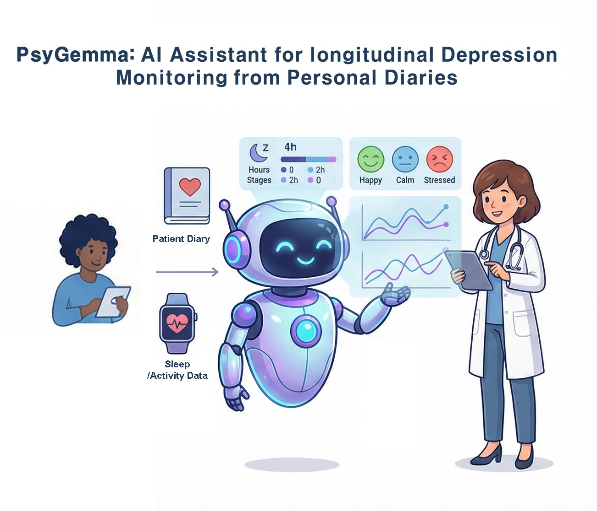

# PsyGemma
An AI Assistant for Depression Monitoring from Personal Diaries

📌 Project Overview
PsyGemma is an advanced clinical support tool that transforms raw patient diary entries into structured medical documentation. By leveraging the MedGemma model, the system identifies depressive markers and maps them directly to DSM-5-TR criteria, enabling clinicians to monitor mental health trajectories with evidence-based precision.

🚀 Core Workflow
Record: Chronicling daily narratives for longitudinal tracking.

Synthesize: Reconstructing raw text into clinical evidence via MedGemma’s targeted prompting.

Structure: Generating formal reports with risk probability and evidence segments.

Visualize: Monitoring status through an intuitive Green-Orange-Red color-coding system.

💻 Key Interface Features
Interactive Timeline: Visualizing the persistence of clinical symptoms over time.

Clinical Evidence Dashboard: Aggregating bookmarked diary segments into consolidated DSM-5-TR reports.

Smart Diaries: Highlighting clinical evidence within raw logs. Users can click highlights or drag to select new sentences to bookmark for deeper analysis.

🧪 Technical Strengths
Cross-lingual Transferability: Successfully handles Korean narratives without language-specific fine-tuning.

Precise Differentiation: Distinguishes between routine stress and clinical depressive vulnerability.

Evidence-Based: Focuses on "baseline ideation" rather than just isolated crisis spikes.
